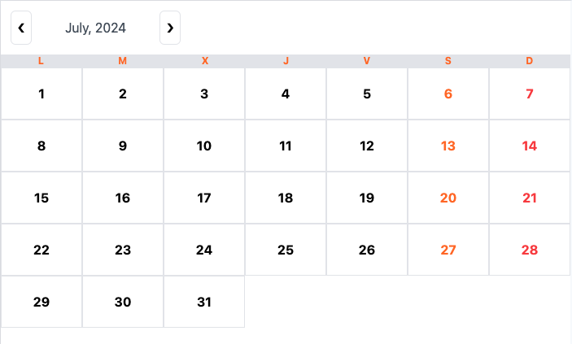

# React Calendar With styles of Tailwindcss

This Calendar it's one of React's components and you should be integrate in yuor app

### One simple example

```jsx
import { Calendar } from './calendar/components/Calendar'

function App() {
    return (
        <div>
            <Calendar
                dayNames={['L', 'M', 'X', 'J', 'V', 'S', 'D']}
                onClick={(day: DayInfo) => console.log(day)}
            />
        </div>
    )
}

export default App
```


